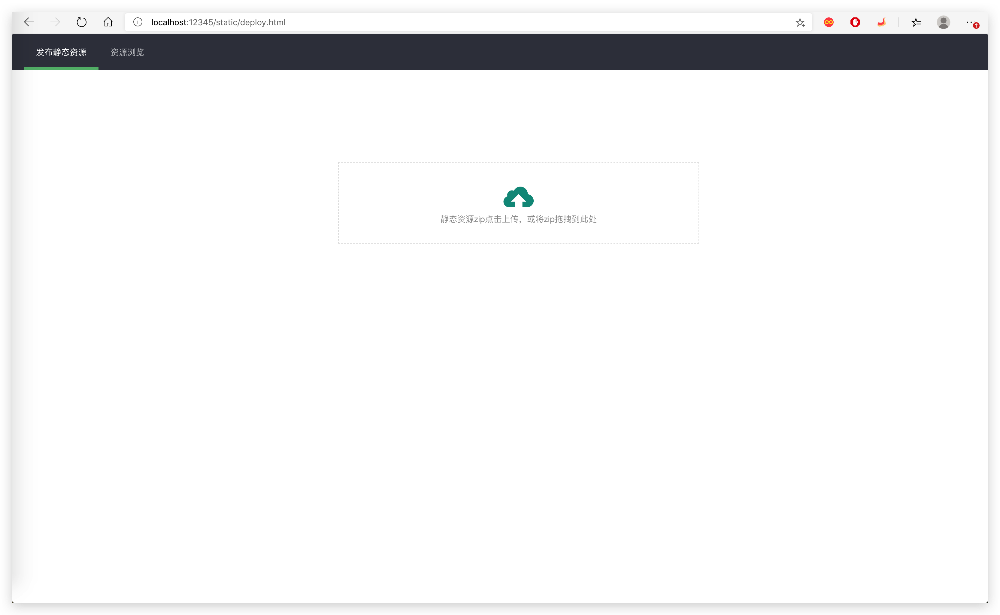
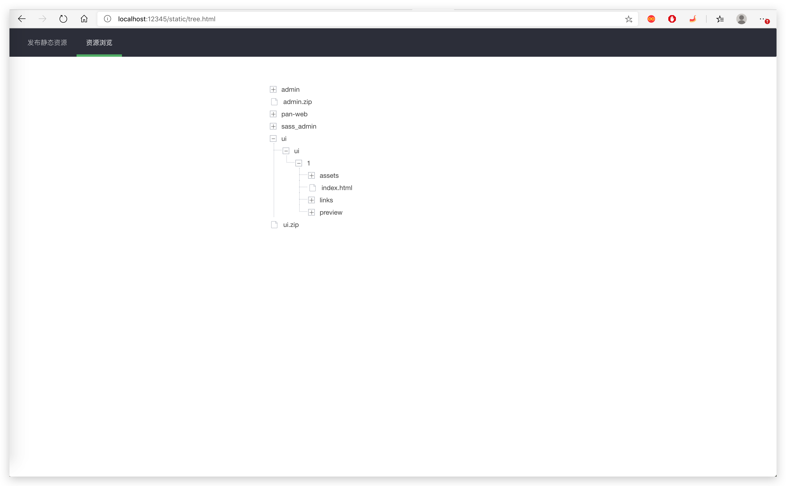

# static

> 发布静态资源

## 部署

- 打包

    ```shell
    ./build.sh
    ```

    打包后的可执行程序在 dist 目录

- 解压

    ```shell
    unzip dist/static.zip -d /some/path/static
    ```

- 运行

    ```shell
    cd /some/path/static
    ./bin/startup.sh
    ```

    默认 12345 端口。

- 关闭

    ```shell
    cd /some/path/static
    ./bin/shutdown.sh
    ```

## Go本地运行

```shell
go run cmd/static/main.go -addr :12345
```

## docker

```shell
docker build -t static .

docker run --name static -p 12345:12345 -d static
```

## 展示

上传静态资源 ZIP 到平台



浏览静态资源


